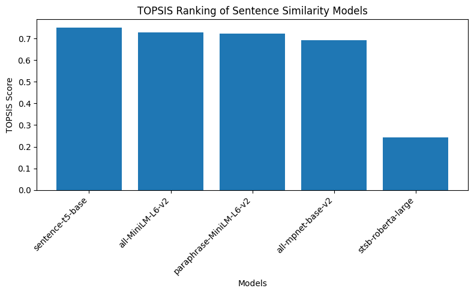

# Topsis-Shubhkaram-102303303

`Topsis-Shubhkaram-102303303` is a Python command-line package for solving **Multi-Criteria Decision Making (MCDM)** problems using the **Technique for Order Preference by Similarity to Ideal Solution (TOPSIS)** method.

This package ranks multiple alternatives based on their closeness to the ideal best solution and distance from the ideal worst solution.

---

## Methodology

TOPSIS is based on the principle that the best alternative should have the **shortest distance from the positive ideal solution** and the **farthest distance from the negative ideal solution**.

### Step-by-Step Procedure

1. **Normalization**

   The decision matrix is normalized using vector normalization to bring all criteria to a comparable scale:

   \[
r_ij = x_ij / sqrt( Σ (x_ij²) )
   \]

2. **Weighting**

   Each normalized value is multiplied by its corresponding criterion weight:

   \[
v_ij = r_ij × w_j
   \]

3. **Ideal Best and Ideal Worst**

   - For **benefit criteria (+)**:  
     Ideal Best = Maximum value, Ideal Worst = Minimum value  
   - For **cost criteria (-)**:  
     Ideal Best = Minimum value, Ideal Worst = Maximum value  

4. **Distance Calculation**

   Euclidean distance from ideal best and ideal worst is calculated:

   \[
S_i+ = sqrt( Σ (v_ij − v_j+)² )   \]

   \[
S_i− = sqrt( Σ (v_ij − v_j−)² )
   \]

5. **TOPSIS Score**

   The performance score is computed as:

   \[
P_i = S_i− / (S_i+ + S_i−)
   \]

   Higher score indicates a better alternative.

---

## Installation

Install the package directly from PyPI:

```bash
pip install Topsis-Shubhkaram-102303303
````

---

## Usage

Run the package using the command line:

```bash
topsis <InputFile> <Weights> <Impacts> <OutputFile>
```

### Example

```bash
topsis data.csv "1,1,1,2" "+,+,-,+" final_output.csv
```

---

## Input Format

The input CSV file should contain:

* First column: Names of alternatives
* Remaining columns: Numeric values of criteria

Example:

| Model | Storage | Camera | Price | Looks |
| ----- | ------- | ------ | ----- | ----- |
| M1    | 16      | 12     | 250   | 5     |
| M2    | 16      | 8      | 200   | 3     |
| M3    | 32      | 16     | 300   | 4     |
| M4    | 32      | 8      | 275   | 4     |
| M5    | 16      | 16     | 225   | 2     |

---

## Output Format

The output file contains:

* Original data
* TOPSIS Score
* Rank of each alternative

Example:

| Model | Storage | Camera | Price | Looks | Topsis Score | Rank |
| ----- | ------- | ------ | ----- | ----- | ------------ | ---- |
| M1    | 16      | 12     | 250   | 5     | 0.534277     | 3    |
| M2    | 16      | 8      | 200   | 3     | 0.308368     | 5    |
| M3    | 32      | 16     | 300   | 4     | 0.691632     | 1    |
| M4    | 32      | 8      | 275   | 4     | 0.534737     | 2    |
| M5    | 16      | 16     | 225   | 2     | 0.401046     | 4    |

---

## Result Analysis

Based on the TOPSIS scores:

* **Model M3** achieves the highest score and is ranked **1st**, indicating the best alternative.
* **Model M2** receives the lowest score and is ranked **5th**, indicating the least preferred option.

The ranking graph (available in the Colab notebook) clearly shows the relative performance of all alternatives.

---

## Google Colab Notebook

The complete implementation, result table, and ranking graph are provided in:

* `TOPSIS_102303303.ipynb`

---

## PyPI Link

[https://pypi.org/project/Topsis-Shubhkaram-102303303/](https://pypi.org/project/Topsis-Shubhkaram-102303303/)

---

## Author

**Shubhkaram Singh**
Roll Number: 102303303


## Experiment Setup

We evaluated five pre-trained sentence similarity models from HuggingFace on a small benchmark dataset of sentence pairs.

### Models Compared
- all-MiniLM-L6-v2  
- all-mpnet-base-v2  
- paraphrase-MiniLM-L6-v2  
- sentence-t5-base  
- stsb-roberta-large  

### Evaluation Criteria
The models were compared using the following criteria:

- **Average Similarity** (higher is better)  
- **Inference Time (ms)** (lower is better)  
- **Model Size (MB)** (lower is better)  
- **Embedding Dimension** (lower is better)  

Weights used: `1, 1, 1, 1`  
Impacts used: `+, -, -, -`  

---


## TOPSIS Result Table

The final ranking obtained using the TOPSIS method is shown below:

| Rank | Model                   |
|------|-------------------------|
| 1    | sentence-t5-base        |
| 2    | all-MiniLM-L6-v2        |
| 3    | paraphrase-MiniLM-L6-v2 |
| 4    | all-mpnet-base-v2       |
| 5    | stsb-roberta-large      |

---

## Ranking Visualization

The bar chart below shows the TOPSIS scores of all evaluated models.



---

## Final Conclusion

Using the TOPSIS multi-criteria decision-making method, **sentence-t5-base** achieved the highest TOPSIS score and is selected as the **best pre-trained model for Sentence Similarity** among the evaluated alternatives.

This approach ensures a balanced selection by considering accuracy, efficiency, and model complexity together.
